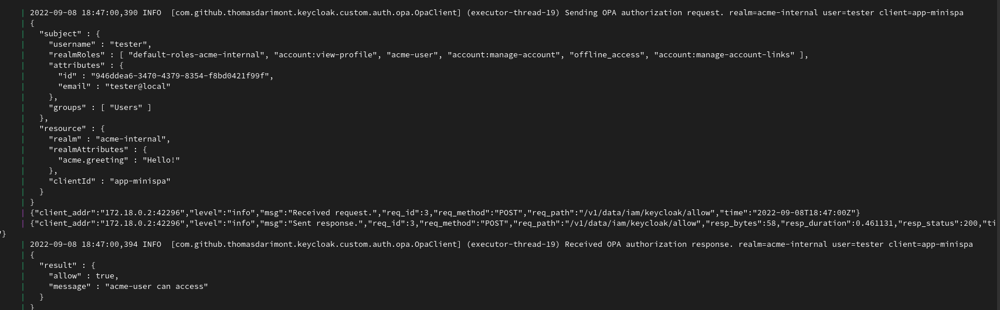

OPA IAM Access Policies
----

# Setup

Example Auth-Flow


Example Authenticator Config


# Deploy policies

## Manually deploy policies
```
curl -v -X PUT --data-binary @config/stage/dev/opa/iam/keycloak/policy.rego  localhost:18181/v1/policies/iam/keycloak
```

# Examples



## Manually evaluate policy

Access denied due to missing `acme-user` role.
```
curl -v POST -H "content-type: application/json" -d '{"input":{"subject":{"username":"tester"}}}' 127.0.0.1:18181/v1/data/iam/keycloak/allow
```

Access granted
```
curl -v POST -H "content-type: application/json" -d '{"input":{"subject":{"username":"tester", "realmRoles":["acme-user"]}}}' 127.0.0.1:18181/v1/data/iam/keycloak/allow
```